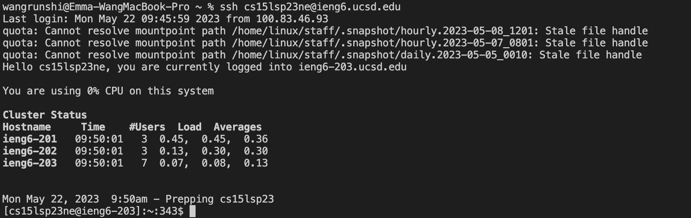
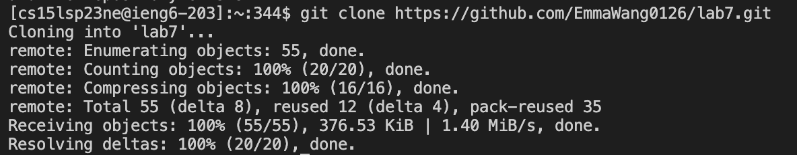
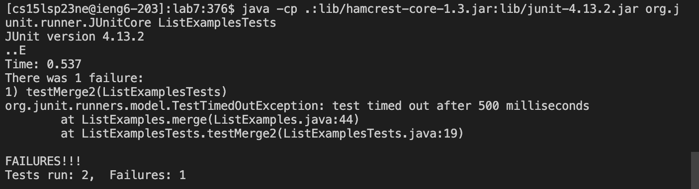
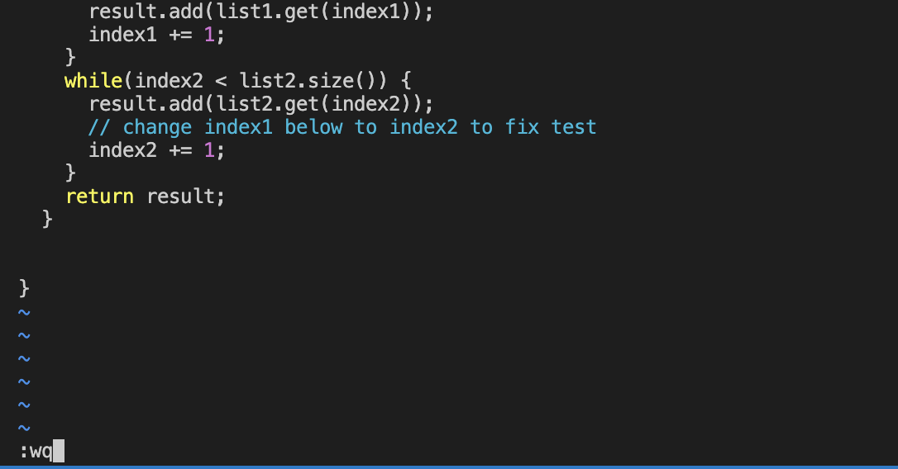
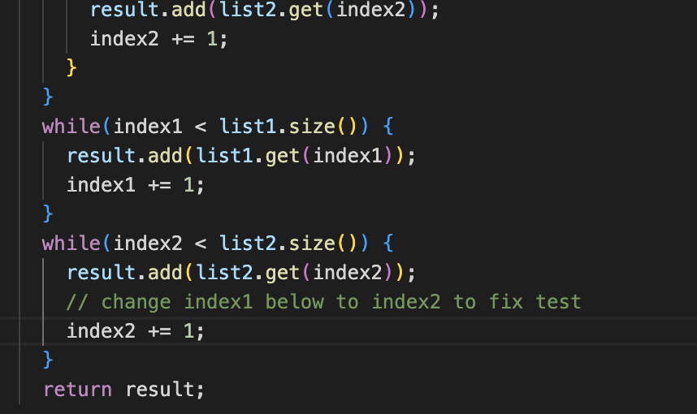
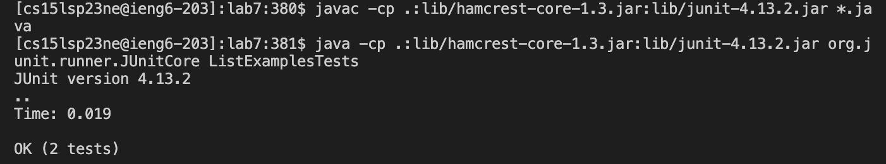
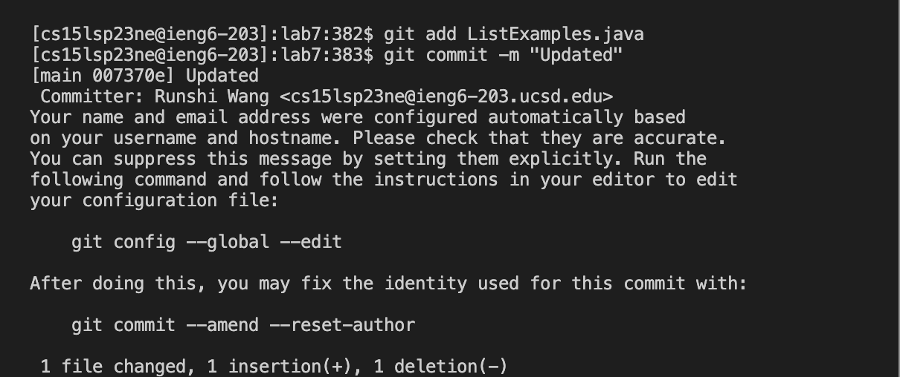
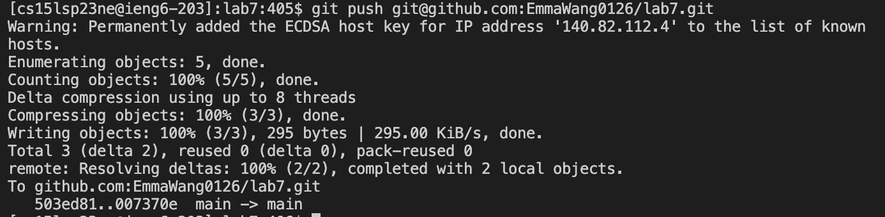

# Reproduce the Task from Timing Tasks                                        
4. Log into ieng6                         
                                    
Type in ```cs15lsp23xx@ieng6.ucsd.edu``` and then your password(or not, if you already generating SSH Keys for ieng6).             
Then ```<enter>```. 

5. Clone your fork of the repository from your github account:   

Enter ```git clone``` in the terminal, then go to github and find the file you need to clone, click ```code``` and copy paste the URL to the command line 
right after the ```git clone```. Then ```<enter>```. 

6. Run the tests, demonstrating they they fail
            
Type in the Junit test code, so cd into lab7, copy from the week3 meterial **crtl-c**, and **ctrl-v** the test code to the command line, for the end of java part, change the to ListExamplesTests. 
```
# code block
javac -cp .:lib/hamcrest-core-1.3.jar:lib/junit-4.13.2.jar *.java
java -cp .:lib/hamcrest-core-1.3.jar:lib/junit-4.13.2.jar org.junit.runner.JUnitCore ListExamplesTests
```

7. Edit the code file to fix the failing test

                                  
Type ```vim ListExamples.java``` in the command line to enter. Press 44 and then ```<enter>``` to go to the line 44, then press ```<right><right><right><right><right>``` to go to column 13, ```<enter> x``` to remove character 1. After that, ```<enter> i ``` to go to insert mode, and press```2``` to change ```index1 += 1``` to ```index2 += 1```. Then ```<esc>``` to exit the insert mode, and type ```:wq``` then ```<enter>``` to save and exit ListExamples.java.

8. Run the tests, demonstrating that they now succeed

  Use ```<up>``` several time until find the the Junit javac test code, which is ```javac -cp .:lib/hamcrest-core-1.3.jar:lib/junit-4.13.2.jar *.java``` and then ```<enter>```, then use ```<up>``` for several times to find Junit java test code, which is ```java -cp .:lib/hamcrest-core-1.3.jar:lib/junit-4.13.2.jar org.junit.runner.JUnitCore ListExamplesTests``` and then ```<enter>```. 
  
9. Commit and push kthe resulting change to your Github account(you can pick any commit message!)


Type ```git add ListExamples.java``` and ```<enter>```, then ```git commit -m 'Updated'``` ```<enter>``` to commit, after that I push the result by typing ```git push git@github.com:EmmaWang0126/lab7.git``` and then ```<enter>``` to push the save file to github page. 
